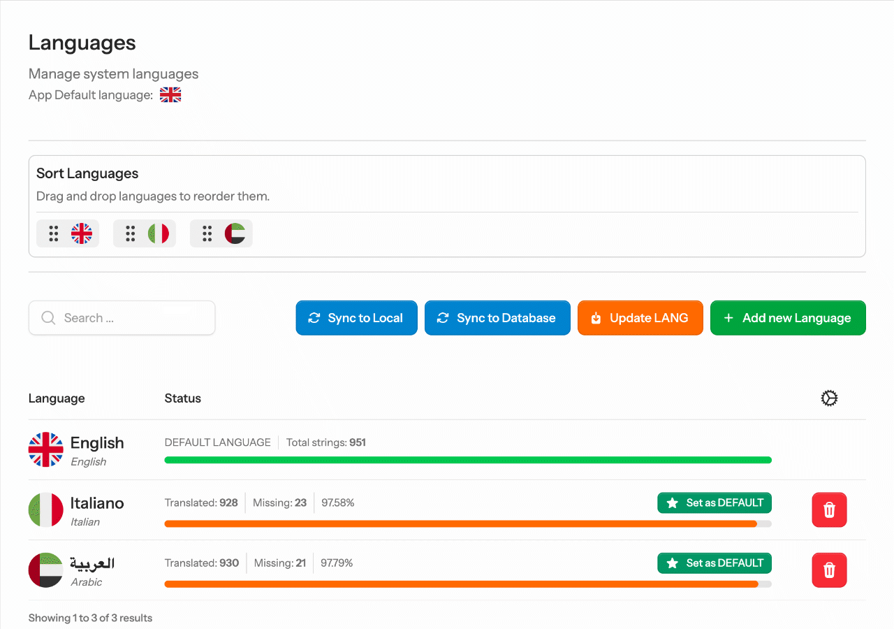
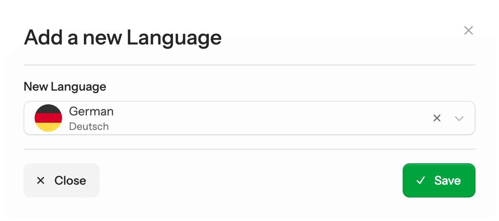

# Language Management

The Languages page (`/lingua/languages`) is your control center for all installed locales.

<figure style="margin: 0 !important; max-width: 100%;">
  
  <figcaption>Languages page — showing installed locales with completion statistics.</figcaption>
</figure>

## Adding a language

### From the UI

Click **Add Language**, select any of the 70+ available locales, and confirm. Lingua will:

1. Download the language files from Laravel Lang
2. Create a `Language` record in the database
3. Sync all new strings into `language_lines`
4. Refresh the table with the new locale

<figure style="margin: 0 !important; max-width: 640px;">
  
  <figcaption>The add-language modal with searchable locale picker.</figcaption>
</figure>

### From the command line

```bash
php artisan lingua:add it
php artisan lingua:add pt_BR
php artisan lingua:add ar
```

### Programmatically

```php
use Rivalex\Lingua\Facades\Lingua;

// Install language files (lang:add wrapper)
Lingua::addLanguage('fr');

// Then create the DB record + sync (what the Artisan command does fully)
// → use lingua:add for the complete, orchestrated flow
```

::: tip
Use `Lingua::notInstalled()` to get the list of locales that are available but not yet installed:

```php
$available = Lingua::notInstalled(); // ['af', 'ar', 'az', …]
```
:::

## Removing a language

Click the trash icon on any non-default language row. A confirmation modal prevents accidental deletion — you must type the language name to confirm.

Behind the scenes, the delete operation:
1. Removes the language files via `lang:rm {locale} --force`
2. Removes all `{locale}` entries from the `language_lines.text` JSON column
3. Deletes the `Language` record
4. Reorders the remaining languages' sort values

::: warning
The **default language cannot be removed**. Set another language as default first.
:::

```bash
# From the command line
php artisan lingua:remove fr
```

## Setting the default language

Click the star icon (⭐) on any language row. Only one language can be default at a time. The change is wrapped in a database transaction to prevent a window where no language is marked as default.

```php
// Programmatically
Lingua::setDefaultLocale('fr');

// Or via the model
$french = Language::where('code', 'fr')->first();
Language::setDefault($french);
```

::: warning Removing the default
If you set a new default language, make sure all your translations are at least partially complete for that locale. The default language is used as the fallback in the UI editor (the left column shows the default value as a reference).
:::

## Reordering languages

Drag and drop language rows to control their display order throughout the application — in the language selector widget, the translations locale switcher, and anywhere you use `Lingua::languages()`.

The sort order is stored in the `sort` integer column and reassigned sequentially after every drop.

## Viewing completion statistics

Each language row shows:

| Metric | Description |
|---|---|
| **Completion %** | `translated / total * 100`, rounded to 2 decimal places |
| **Missing** | Number of strings with no value for this locale |

These are computed at query time via database subqueries against the `language_lines` table, so they are always up to date.

```php
// Get stats for a specific locale
$stats = Lingua::getLocaleStats('fr');
// [
//   'total'      => 1240,
//   'translated' => 980,
//   'missing'    => 260,
//   'percentage' => 79.03,
// ]

// Or get all languages with stats in one query
$languages = Lingua::languagesWithStatistics();
foreach ($languages as $lang) {
    echo "{$lang->name}: {$lang->completion_percentage}%";
}
```

## Sync controls

The Languages page toolbar has three sync buttons:

| Button | Action |
|---|---|
| **Sync to database** | Imports all local `lang/` files into `language_lines` |
| **Sync to local** | Exports all DB translations back to `lang/` files |
| **Update via Laravel Lang** | Runs `lang:update` to pull the latest strings from upstream, then syncs to DB |

All three operations run **asynchronously** (Livewire `#[Async]` attribute) so the UI remains responsive during long-running syncs.
