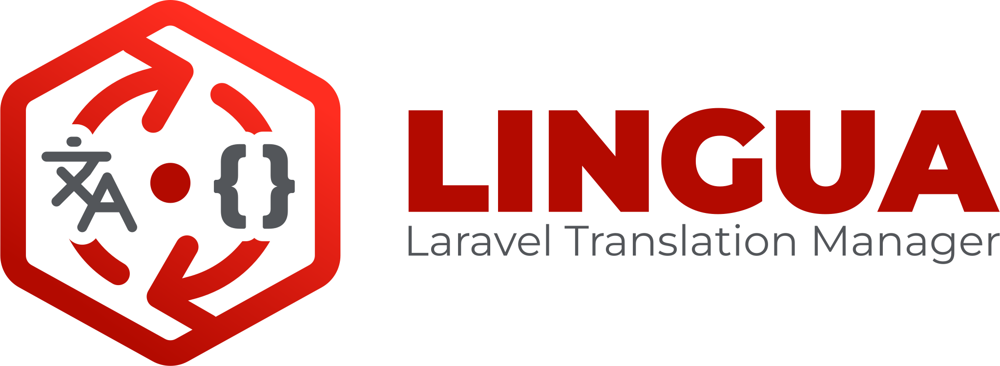
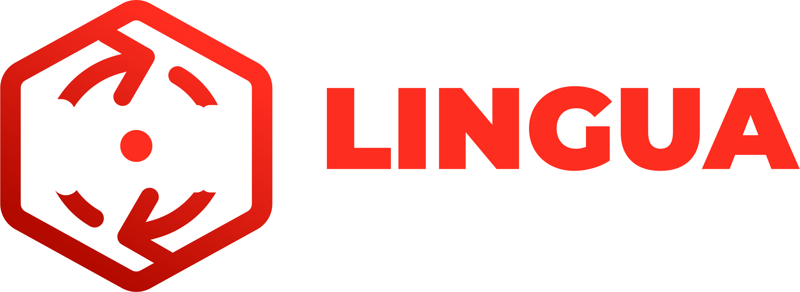

<figure style="margin: 30px auto 30px !important; max-width: 640px;">
  
  
</figure>

# Lingua क्या है?

Lingua एक **Laravel पैकेज** है जो डिफ़ॉल्ट फ़ाइल-आधारित अनुवाद प्रणाली को एक पूर्णतः डेटाबेस-संचालित प्रणाली से बदल देता है, जिसमें [Livewire 4](https://livewire.laravel.com) और [Flux 2](https://fluxui.dev) पर बना एक सुंदर, रिएक्टिव प्रबंधन UI शामिल है।

## यह किस समस्या को हल करता है

मानक Laravel अनुवाद `lang/` के अंदर PHP और JSON फ़ाइलों में होते हैं। यह छोटे प्रोजेक्ट के लिए ठीक है, लेकिन जैसे-जैसे एप्लिकेशन बढ़ता है, इसमें कठिनाई आती है:

- **अनुवाद अपडेट करने के लिए डिप्लॉयमेंट की ज़रूरत होती है** - साधारण टाइपो ठीक करने के लिए भी।
- **गैर-तकनीकी टीम के सदस्य अनुवाद नहीं कर सकते** - संपादकों को Git और कोड रिव्यू की जानकारी चाहिए।
- **अनुवाद पूर्णता ट्रैक करना मैनुअल है** - अंतराल खोजने के लिए फ़ाइलों की तुलना करनी पड़ती है।
- **कई लोकेल्स कोडबेस को बिखेर देते हैं** - डायरेक्टरीज़ में दर्जनों फ़ाइलें फैली होती हैं।

Lingua प्रत्येक अनुवाद को डेटाबेस में, प्रति पंक्ति एकल JSON कॉलम में संग्रहीत करता है, और एक Livewire UI प्रदान करता है जहाँ कोई भी अधिकृत उपयोगकर्ता रियल टाइम में भाषाएँ और स्ट्रिंग्स प्रबंधित कर सकता है।

## यह कैसे काम करता है

```
┌─────────────────────────────────────────────────────────┐
│                   Laravel Application                   │
│                                                         │
│  lang/en/messages.php  ──┐                              │
│  lang/fr/messages.php    │  lingua:sync-to-database     │
│  lang/en.json            ├─────────────────────────────►│
│  lang/vendor/…           │                              │
│                         ─┘   language_lines (DB)        │
│                              ┌──────────────────────┐   │
│  LinguaMiddleware  ◄──────── │ group │ key │ text   │   │
│  app()->setLocale()          │ auth  │ … │ {"en":…} │   │
│                              └──────────────────────┘   │
│  __('auth.failed')  ───────────────────────────────────►│
│  (DB takes precedence over files)                       │
└─────────────────────────────────────────────────────────┘
```

रनटाइम पर, Lingua एक कस्टम `LinguaManager` को Laravel translation loader के रूप में पंजीकृत करता है। यह फ़ाइल-आधारित और डेटाबेस अनुवादों को मिलाता है - **डेटाबेस एंट्रियाँ हमेशा प्राथमिकता लेती हैं** - ताकि आप सोर्स फ़ाइलों को छुए बिना किसी भी स्ट्रिंग को ओवरराइड कर सकें।

## मुख्य अवधारणाएँ

| अवधारणा | विवरण |
|---|---|
| **Language** | मेटाडेटा के साथ एक इंस्टॉल किया हुआ लोकेल (नाम, मूल नाम, दिशा, सॉर्ट क्रम, डिफ़ॉल्ट फ्लैग) |
| **Translation** | `language_lines` में एक पंक्ति जिसमें `group`, `key`, `type`, और एक JSON `text` कॉलम है जिसमें सभी लोकेल वैल्यू हैं |
| **Translation type** | `text`, `html`, या `markdown` - UI में कौन सा एडिटर दिखाया जाए यह निर्धारित करता है |
| **Vendor translation** | एक तृतीय-पक्ष पैकेज से संबंधित अनुवाद; आकस्मिक हटाने से सुरक्षित |
| **Default locale** | प्राथमिक भाषा; डिफ़ॉल्ट लोकेल के लिए अनुवाद हटाने से पूरा रिकॉर्ड हट जाता है |
| **Sync** | स्थानीय फ़ाइलों → DB (`sync-to-database`) या DB → फ़ाइलों (`sync-to-local`) में आयात/निर्यात की प्रक्रिया |

## आवश्यकताएँ

| निर्भरता | संस्करण |
|---|----------|
| PHP | **8.2+** |
| Laravel | **11 \| 12 \| 13** |
| Livewire | **4.0+** |
| Livewire Flux | **2.0+** |

## अगला कदम

पाँच मिनट से भी कम समय में Lingua सेट अप करने के लिए [इंस्टॉलेशन गाइड](/hi/guide/installation) पर जाएँ।
